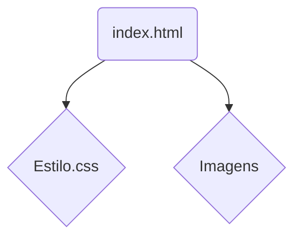

## **## Criando um Readme.md para o seu Projeto de Lesão por Pressão**

**## Entendendo o Projeto**

Antes de começarmos a escrever o Readme, vamos resumir o que o seu projeto faz:

* **Tema:** Lesão por Pressão em Idosos
* **Objetivo:** Informar sobre as causas, prevenção e tratamento de lesões por pressão, com foco em cuidados de enfermagem.
* **Tecnologias:** HTML, CSS

**## Estrutura do Readme.md**

Um bom Readme.md deve ser claro, conciso e fácil de entender, tanto para você quanto para outros desenvolvedores. Aqui está uma sugestão de estrutura:

```markdown
# Lesão por Pressão em Idosos

## Descrição
Este projeto web tem como objetivo fornecer informações importantes sobre lesões por pressão em idosos, abordando temas como:

* Causas
* Prevenção
* Tratamento
* Cuidados de enfermagem

## Tecnologias Utilizadas
* **HTML:** Estrutura da página
* **CSS:** Estilização da página

## Como Usar
1. **Clone o repositório:**
   ```bash
   git clone https://seu-repositorio.git
   ```
2. **Abra o arquivo index.html:**
   Você pode abrir o arquivo index.html em qualquer navegador web.

## Contribuições
Contribuições são bem-vindas! Para contribuir com este projeto, siga estes passos:

1. Fork este repositório
2. Crie um novo branch
3. Faça suas alterações
4. Crie um pull request

## Licença
Este projeto está licenciado sob a licença [Nome da Licença].

## Autores
* Mateus
* Gleicymara
* Lorena
* Vanderson
* Izabela Furriel
* Marlon
* Milerne
* Mônica

## Agradecimentos
Agradecemos a todos que contribuíram para este projeto.
```

## **## Personalizando o Seu Readme**

**## Adicionando Mais Detalhes**

Você pode personalizar ainda mais o seu Readme adicionando:

* **Imagens:** Use imagens para ilustrar o seu projeto.
* **Diagrama:** Crie um diagrama simples para mostrar a estrutura do seu projeto.
* **Guia de Estilo:** Defina um guia de estilo para o seu projeto (se aplicável).
* **Instruções de Build:** Se você tiver um processo de build, adicione instruções detalhadas.
* **Demonstração:** Inclua um link para uma demonstração online do seu projeto (se disponível).

**## Exemplo com Imagens e Diagrama**

```markdown
# Lesão por Pressão em Idosos

[Imagem da página inicial]

## Descrição
...

## Diagrama da Estrutura


## **## Dicas Adicionais**

* **Use Markdown:** Markdown é uma linguagem simples para formatar texto.
* **Seja Claro e Conciso:** Use frases curtas e objetivas.
* **Use Cabeçalhos:** Organize o seu Readme com cabeçalhos (H1, H2, etc.).
* **Formatação:** Utilize negrito, itálico e listas para destacar informações importantes.
* **Atualize Frequentemente:** Mantenha o seu Readme atualizado à medida que o seu projeto evolui.

**## Ferramentas Úteis**

* **Visual Studio Code:** Um editor de código com suporte a Markdown e visualização ao vivo.
* **GitHub Markdown Guide:** Uma guia completa sobre Markdown no GitHub.

Com este guia, você terá um Readme.md bem estruturado e informativo para o seu projeto. 

**Lembre-se:** Um bom Readme é fundamental para atrair colaboradores e facilitar a compreensão do seu projeto por outras pessoas.

**Gostaria de adicionar mais alguma coisa ao seu Readme?** 
